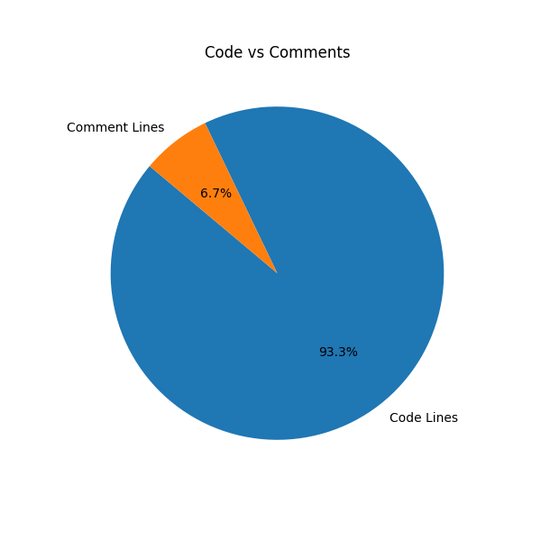
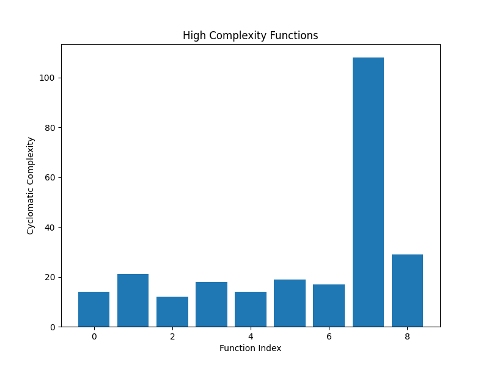

# Code Metrics Analyzer

**Code Metrics Analyzer** is a Python tool for analyzing the codebase of your projects. It helps you evaluate code quality, identify complex functions, detect unused (dead) code, and generate detailed reports with visualizations.

## Features
- **Metrics Collection**:
  - Count the number of files and lines of code (SLOC, LOC).
  - Analyze comment lines.
- **Complexity Analysis**:
  - Calculate cyclomatic complexity of functions.
  - Identify "heavy" functions for refactoring.
- **Dead Code Detection**:
  - Find functions that are defined but never used.
- **Report Generation**:
  - Generate a detailed text report (`report.txt`).
  - Visualize data with charts (`.png`).

## Installation
1. Clone the repository:
   ```bash
   git clone https://github.com/chr1stopherdev/code-metrics-analyzer.git
   cd code-metrics-analyzer
   ```

2. Install the dependencies:
   ```bash
   pip install -r requirements.txt
   ```

3. Run the project:
   ```bash
   python main.py
   ```

## Usage
1. Start the analysis:
   ```bash
   python main.py
   ```
2. Enter the path to your project:
   ```
   Enter the path to your project: /path/to/your/project
   ```
3. After the analysis is complete, the following files will be generated:
   - `report.txt` — A detailed text report with metrics and recommendations.
   - `code_comments_pie.png` — A pie chart of code vs. comments.
   - `complexity_histogram.png` — A bar chart of function complexities.

## Running Tests
To run the tests:
```bash
python -m unittest discover -s tests
```

## Project Structure
```plaintext
code_metrics_analyzer/
├── main.py               # Entry point
├── config.py             # Configuration file
├── core/
│   ├── metrics.py        # Metrics collection module
│   ├── complexity.py     # Complexity analysis module
│   ├── dead_code.py      # Dead code detection module
│   └── report_generator.py # Report generation module
├── utils/
│   ├── file_utils.py     # File handling utilities
│   ├── data_utils.py     # Data processing utilities
│   └── visualizer.py     # Data visualization module
└── tests/
    ├── test_metrics.py   # Tests for metrics calculation
    ├── test_complexity.py# Tests for complexity analysis
    └── test_all.py       # Combined tests
```

## Example Output
1. **Pie Chart (Code vs Comments)**  
   

2. **Complexity Histogram (High Complexity Functions)**  
   
